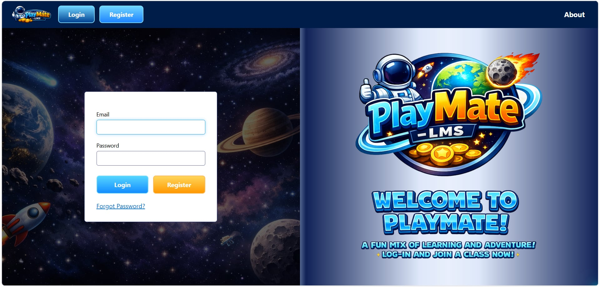
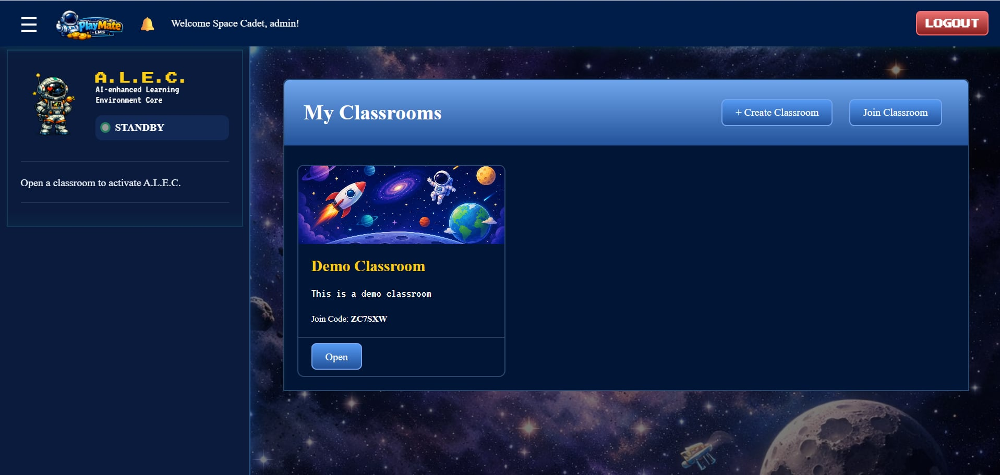
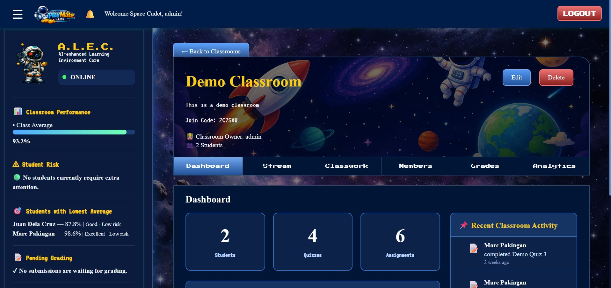
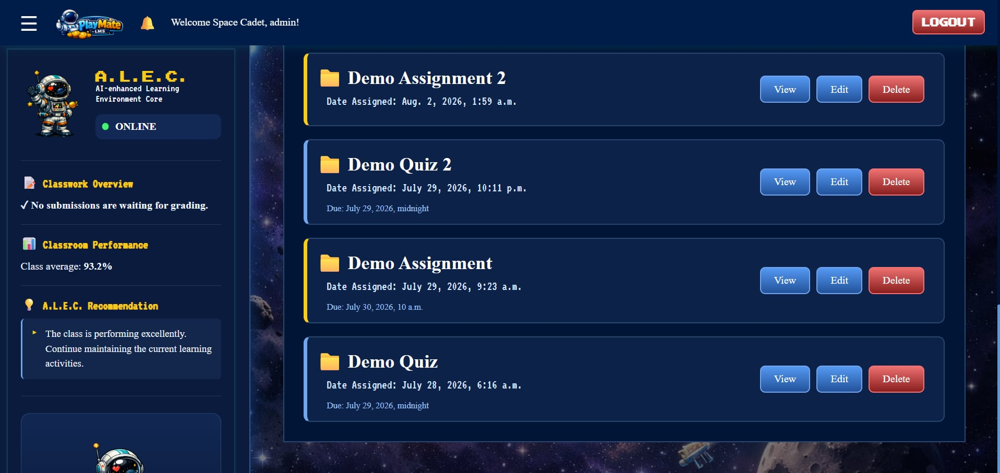
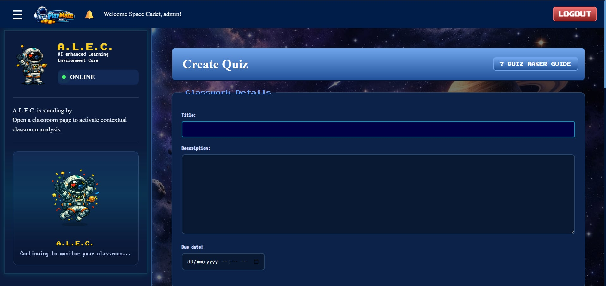
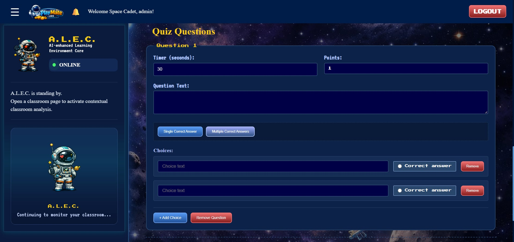
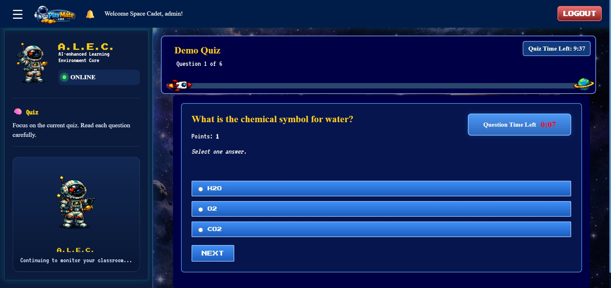

# PlayMate

PlayMate is a gamified classroom-based learning management system developed using Django Framework and Python as part of my programming and web development practice.

## About the Project

PlayMate combines game mechanics and visuals with educational activities to create an interactive learning experience.

The project was developed to practice Python programming, web and system development concepts, user interaction, and application logic.

The project also contains several features that aims to help educators with increasing the learning engagement of their students such as mildly gamified quizzes (Visuals and Timers) and an informational dashboard that contains their performance and progress in that specific classroom.

## Features

* Classrooms (Create/Join)
* Classroom-Based Role Assignment
* Quiz Builder(per classroom)
* Classroom performance tracking and analytics
* Notifications(per classroom)
* A.L.E.C.(AI-Enhanced Learning Environment Core) Sidebar
* Gamified interface and menus

## Screenshots

### Login

### Home Dashboard

### Classroom Dashboard

### Classwork

### Quiz Builder

### Quiz Attempt

## Technologies Used

* Python
* Django
* HTML
* CSS
* JavaScript

## Project Structure

The project is organized into separate files and folders for the system's logic, assets, and other components.

## How to Run

1. Clone or download this repository.
2. Open the project folder in VS Code or another Python-compatible IDE.
3. Install the required dependencies.
4. Run the main Python file.

## Author

**Marc Pakingan**

BSIT Student
